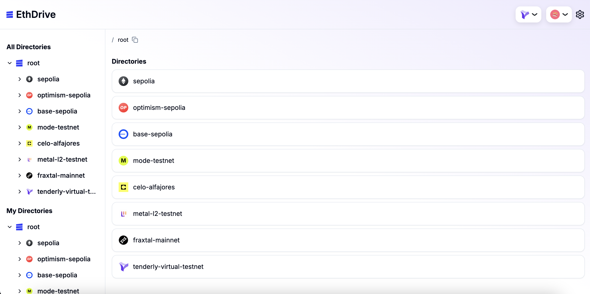
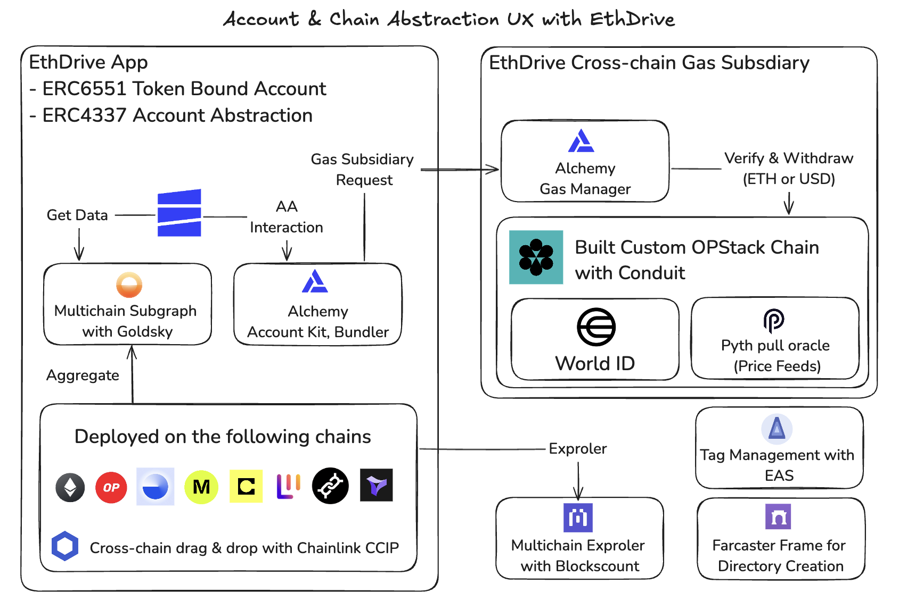

# EthDrive

Here’s a wallet like you’ve never seen before—Google Drive for your assets. Organize and manage your assets with a directory structure, trade them, and even connect your directories to dApps.

## Demo App

https://super-eth-drive.vercel.app/

## Description

EthDrive is a service that allows you to organize and manage the assets in your wallet like Google Drive. By combining ERC6551 and Account Abstraction, it enables asset organization, transfers, bridging, swapping, and even connections to various dApps with a user-friendly interface similar to cloud storage services.

Directories are created as NFTs, and assets can be stored within them. This allows users to view all directories transparently and centrally, much like directory functions within a single computer. We call this the Universal Directory. Just like ENS, all directories become part of the Universal Directory, making it accessible for everyone to use.

To enhance the UX of EthDrive, we have created a dedicated L2 chain for gas fee subsidies. Users with a World ID can receive gas fee subsidies, making EthDrive even more convenient to use.

## How it's made

We used the following core elements to manage multiple accounts across different chains:

- ERC6551 Token Bound Account
- ERC4337 Account Abstraction
- Cross-chain Bridge and Cross-chain Gas Subsidiary

By combining these elements, we created an Account & Chain Abstraction UX that allows users to manage assets across multiple accounts and chains with a simple drag-and-drop between directories.

In our system, each directory is an NFT with a corresponding Token Bound Account, allowing users to manage the directory as an account through account abstraction. We've deployed smart contracts on Ethereum Sepolia, Optimism Sepolia, Base Sepolia, Mode Testnet, Celo Alfajores, Metal L2 Testnet, Fraxtal Mainnet, and Tenderly Virtual Testnet. We use Chainlink CCIP as a cross-chain bridge to enable seamless cross-chain asset transfers. Smart contract data is then aggregated using a Goldsky subgraph, and Blockscount is used as a multichain explorer for all chains. To enhance wallet management, we implemented tag management with EAS, allowing users to manage multiple wallets more effectively. Additionally, we've integrated Farcaster Frame to improve the onboarding experience.

We used Alchemy Account Kit for account abstraction and set up an extension for Alchemy Gas Manager. This setup verifies users with World ID for Sybil detection and allows them to deposit gas on a custom OPStack chain. The deposited gas is then used across all connected chains during transactions. Additionally, the custom chain integrates Pyth as a price oracle, enabling the acceptance of more chains within the system.
