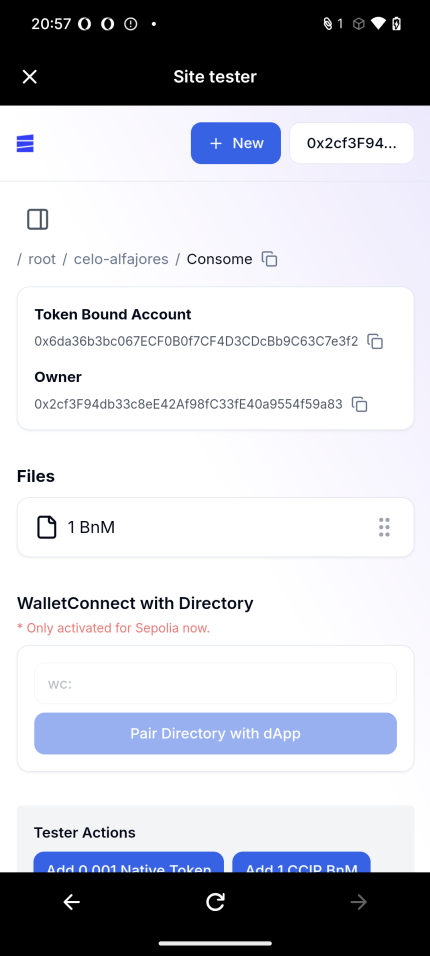
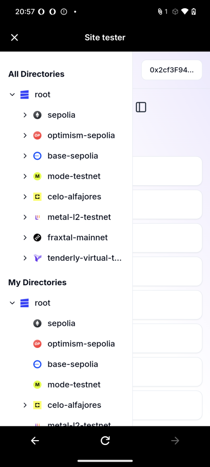
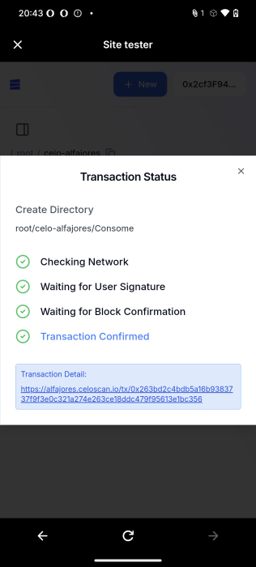

# Celo Integration

We deployed our Google Drive-like wallet management system, utilizing ERC6551 token-bound accounts and ERC4337 account abstraction, to Celo Alfajores. Despite the complexity of the application, we focused on building a mobile-first UI and successfully tested all functionalities using the Minipay tester.

## Minipay Integration Test

We conducted an integration test for Minipay using the MiniPay Site Tester.

### Screenshots

When the user accesses EthDrive, the interface displays a mobile-responsive design for directories.

To enhance the mobile user experience, we focused on improving the UX, including adding a sidebar.

We successfully tested a transaction using Minipay.

### Note

- Ensure that the Minipay account has sufficient cUSD and that Testnet access is enabled.

## Deployed Contracts

- EthDrive

  - https://alfajores.celoscan.io/address/0x73E5D195B5cf7EB46DE86901AD941986E74921CA

## Implementation References

- Minipay integration

  - https://github.com/Heterod0x/EthDrive/blob/main/app/src/components/Header.tsx#L41

- UI integration

  - https://github.com/Heterod0x/EthDrive/blob/main/app/src/app/providers.tsx#L36
