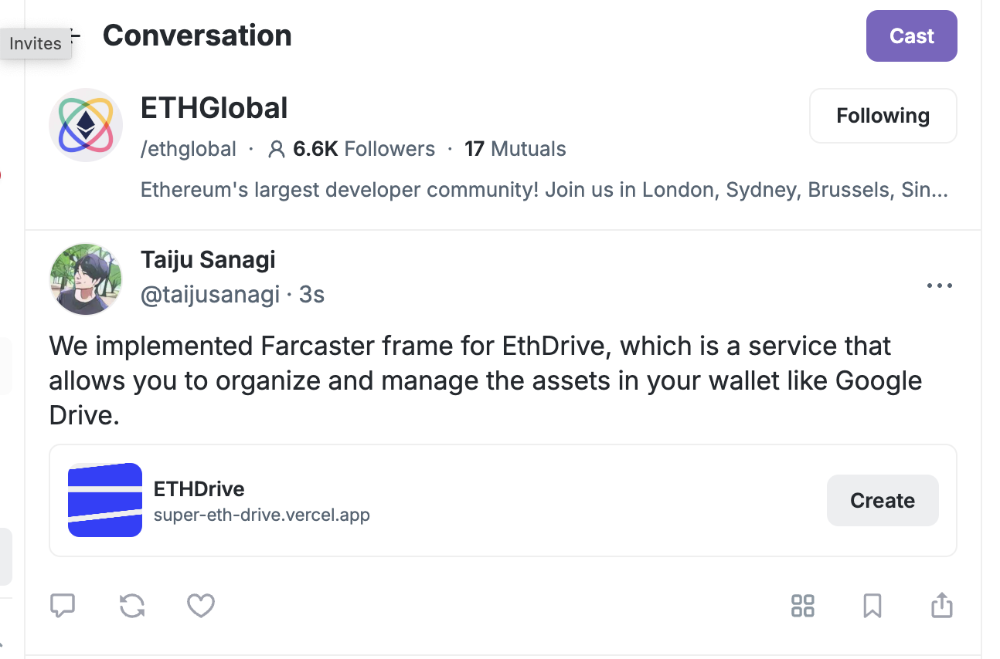
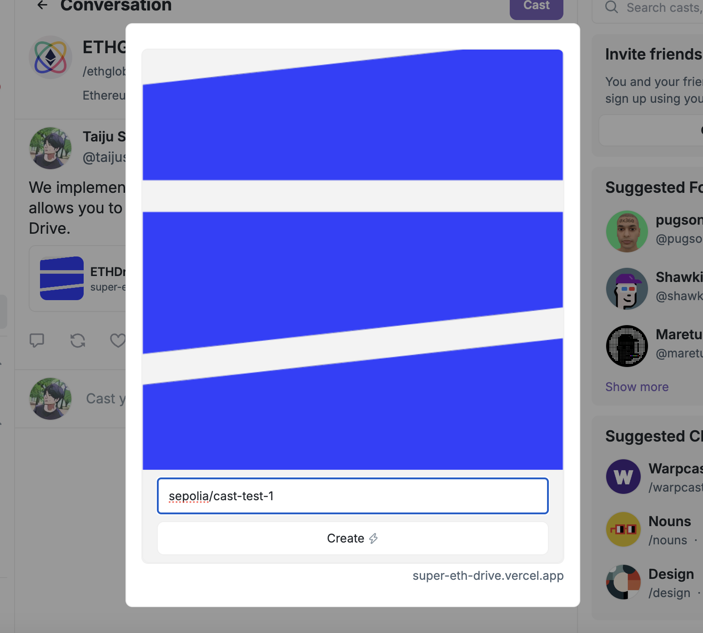
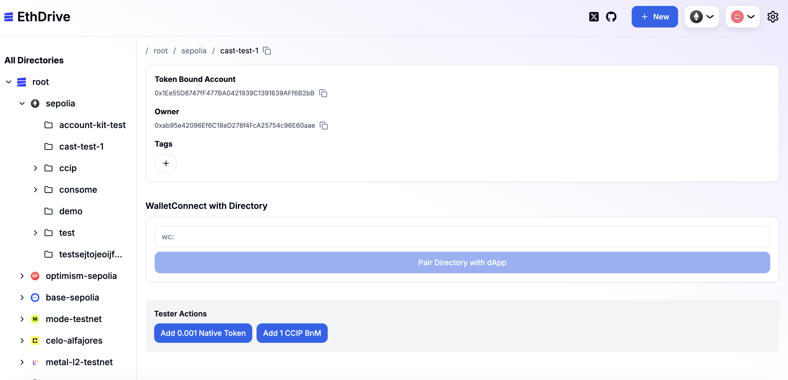

## Farcaster Integration

We used Farcaster to make the onboarding process more accessible. Users can also create directories in EthDrive through Cast!

## Screenshots

To enhance the mobile user experience, we focused on improving the UX, including adding a sidebar.

We successfully tested a transaction using Minipay.

## Implementation Reference

- Frame

  - https://github.com/Heterod0x/EthDrive/blob/main/app/src/app/frames/route.tsx

- TxData

  - https://github.com/Heterod0x/EthDrive/blob/main/app/src/app/frames/txdata/route.tsx
