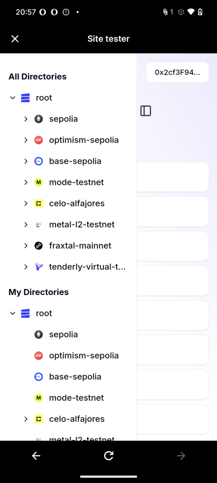

## Minipay Integration Test

We conducted an integration test for Minipay using the MiniPay Site Tester.

## Screenshots

When the user accesses EthDrive, the interface displays a mobile-responsive design for directories.

To enhance the mobile user experience, we focused on improving the UX, including adding a sidebar.

We successfully tested a transaction using Minipay.

## Note

- Ensure that the Minipay account has sufficient cUSD and that Testnet access is enabled.
